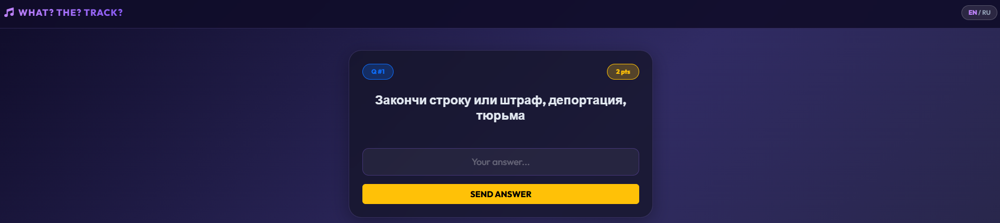

***

# 🎧 WHAT? THE? TRACK? — Interactive Music Quiz

**WHAT? THE? TRACK?** (Purple Edition) is a modern web application for conducting real-time music quizzes. The host manages the game via an admin panel, while players answer questions using their smartphones.

The project is built on WebSockets, ensuring instant synchronization across all devices.


---

## ✨ Key Features

### 🎮 Gameplay
*   **Real-time Synchronization:** Screens change (Waiting → Question → Answer) simultaneously for everyone.
*   **VIP Player:** The first connected player gets "Captain" rights and can trigger the next question if the host is distracted.
*   **Various Mechanics:** Supports multiple-choice questions and manual text entry.
*   **Multi-language:** Full support for English and Russian (toggle in the interface).

### 👮 Administration
*   **Full Control:** The host manages music playback, timers, and scoring.
*   **Smart Validation:** The system automatically checks text answers (ignoring case and punctuation).
*   **Live Monitoring:** The host sees player answers as they come in.
*   **Manual Adjustment:** Ability to add or deduct points from any player at any time.

### 🎨 Visuals
*   **Glassmorphism UI:** Stylish design in purple tones with a glass effect.
*   **Leaderboards:** The score table updates after every round.
*   **Finale:** Celebratory fireworks on the winners' screens.

---

## 📸 Interface & Controls

### 1. Admin Panel (Host)
The Admin Panel is the game's control center. It is recommended to open it on a laptop or tablet.


**Main Controls:**
*   **Audio Player:** Top block. Plays the tracks.
*   **START GAME / RESTART:** Starts a new session and resets player scores.
*   **Playlist Queue:** Displays game progress.
    *   🟣 Purple: Current question.
    *   🟢 Green: Completed question.
*   **Players:** List of connected participants.
    *   `+` and `-` buttons: Manually adjust player scores.
    *   `✓` Indicator: Shows who has already submitted an answer for the current round.

**Round Controls (Bottom Buttons):**
1.  **START/NEXT:** Loads the next question and sends it to players.
2.  **Play (in player):** Starts the "Mystery Track" (player input is locked).
3.  **Music Ends:** As soon as the mystery track finishes, the input field appears **automatically** for players.
4.  **ANSWER (Eye Icon):** Reveal the correct answer, play the "Reveal Track" (chorus), and update the leaderboard.

---

### 2. Player Interface (Mobile)
Players join the game via a browser. No downloads required.



**Flow:**
1.  **Login:** Player enters a nickname.
2.  **Waiting:** "Waiting for round...".
3.  **Question (Listening):** Question text is visible, music plays. Input is locked.
4.  **Input:**
    *   *Choice:* 4 buttons with options.
    *   *Text:* Input field.
5.  **Result:** Player sees the correct answer, earned points, and their rank.
6.  **"NEXT QUESTION" Button:** Appears **only for the first player (VIP)** after the reveal track finishes, allowing them to speed up the game.

---

## ⚙️ Content Setup (Important!)

The game relies on files you must prepare in advance.

### Step 1: Audio Files
Create a `media` folder in the project root. You need two files for each question:
1.  **Mystery:** A snippet of the song (10-20 sec) to guess.
2.  **Reveal:** The chorus or continuation of the song (plays when showing the answer).

**Filename format is strict:**
`{ID}-1.mp3` — Mystery (Question)
`{ID}-2.mp3` — Reveal (Answer)

> Example for Question ID 1:
> `media/1-1.mp3`
> `media/1-2.mp3`

### Step 2: Script (questions.json)
Create a `questions.json` file in the project root. This is an array of objects.

**File Example:**
```json
[
  {
    "id": 1,
    "type": "choice",
    "question": "Which movie features this song?",
    "options": ["Shrek", "Titanic", "The Matrix", "The Lion King"],
    "answer": "Shrek"
  },
  {
    "id": 2,
    "type": "text",
    "question": "Name the artist",
    "options": [],
    "answer": "Queen"
  }
]
```

*   **id**: Number. Must match the mp3 filename.
*   **type**:
    *   `"choice"` — 4 options (1 point).
    *   `"text"` — Keyboard input (2 points).
*   **options**: Array of 4 strings (only for `choice` type).
*   **answer**: The correct answer string.

---

## 🚀 Installation & Launch

### Prerequisites
*   Computer (Windows/Mac/Linux)
*   Installed [Docker Desktop](https://www.docker.com/products/docker-desktop) (Recommended)
*   Wi-Fi router (all devices must be on the same network)

### Method 1: Docker (Fast & Reliable)

1.  **Clone the project:**
    ```bash
    git clone https://github.com/YOUR_USERNAME/music-game.git
    cd music-game
    ```

2.  **Add content:**
    *   Place mp3 files into the `media/` folder.
    *   Edit `questions.json`.

3.  **Run:**
    ```bash
    docker-compose up --build
    ```

4.  **Open in browser:** `http://localhost:5000`

### Method 2: Manual Launch (Python)

1.  Install Python 3.9+.
2.  Create a virtual environment: `python -m venv venv`.
3.  Activate it and install dependencies:
    ```bash
    pip install -r requirements.txt
    ```
4.  Run the server (Production mode):
    ```bash
    gunicorn -k eventlet -w 1 --bind 0.0.0.0:5000 app:app
    ```
    *Or for development:* `python app.py`

---

## 🎮 How to Start a Game (Checklist)

1.  Start the server.
2.  Find your **Local IP Address** on the network (e.g., `192.168.1.5`).
    *   *Windows:* `ipconfig`
    *   *Mac/Linux:* `ifconfig` or `ip a`
3.  **Host:** Opens `http://localhost:5000/admin` (Login: `admin`, Password: `password`).
4.  **Players:** Open `http://192.168.1.5:5000` on their phones.
5.  Host clicks **START GAME** and let's go!

## 🔒 Security

Default credentials are set in `app.py`. Change them before a real game:

```python
# app.py
ADMIN_USER = "admin"  # <-- Change this
ADMIN_PASS = "password" # <-- Change to a strong password
```

## 🛠 Tech Stack

*   **Backend:** Python, Flask, Flask-SocketIO, Eventlet.
*   **Frontend:** HTML5, CSS3, Bootstrap 5, FontAwesome.
*   **Protocol:** WebSockets (Socket.IO).
*   **Deployment:** Docker, Gunicorn.

---
Created with ❤️ for music lovers.